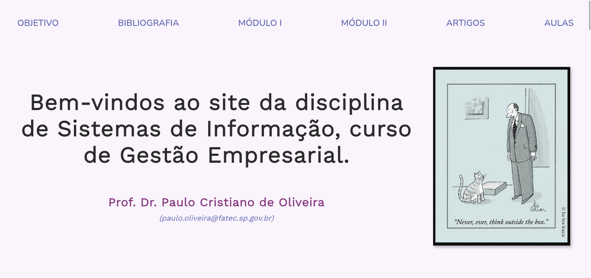

# SITE - SISTEMAS DE INFORMAÇÃO

Este repositório contém o projeto de redesign do [site](https://sites.google.com/site/pcosigestao) utilizado pelo professor [Paulo Cristiano de Oliveira](http://lattes.cnpq.br/9574943370988109) para a disciplina **Sistemas de Informação** do curso de *Gestão Empresarial* da Fatec Zona Leste realizado em Agosto de 2021.
